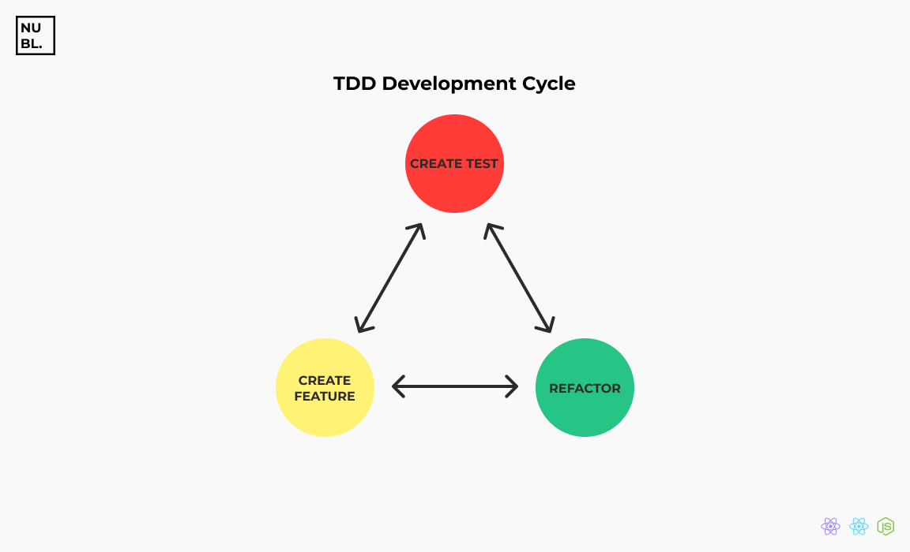

Every application needs tests, and with tests, i'm not talking about manual tests that you (of course a Junior developer) make in your application, i'm talking about automated tests.

> Automated test is a use of a software to control tests execution in your application comparing the expected results with the actual results.

## Why should I use an software to test my application if I can do it myself?

Yea, you're right, you can do it, but as your application grows, you'll be unable to remember and control your entire business rule or to know where the application errors is it from and that's why automated tests exists.

Once automated tests are created, they can be easily repeated and perform tasks that manually would be boring to perform.

Let's imagine a case that we want to test if our application correctly sign up users and save them into your data base:

### Manual tests

- Open your REST Client (Insomnia REST or Postman)
- Create a sign up route (**/signup**)
- Insert the user data to sign up
  ```json
  {
    "username": "nubelsondev",
    "email": "myemail@hmail.com",
    "password": "MyPassworD2020"
  }
  ```
- Verify if it was saved on your DB

### Automated tests

- Run the test script
  ```bash
  yarn test
  ```

I think you already understand how much the automated testing saves you from waisting your time, that's why they are essential components in the application development process.

Now that you know why you should perform automated tests on your application, I want to introduce you to a technique that will make your development even better, **TDD** (_Test Driven Development_).

## TDD

> TDD is a technique that consists of developing our application based on tests that are written before our business rules (production code).

That's right, you create the tests even before your application code.

This technique makes you better understand how the whole business rule of your application really works once you go through the **TDD development cycle**.

### Development Cycle

Our Test-Driven Development is based on a cycle of repetitions where for each feature of our application, a test is created beforehand.



1. We create the test (**initially does not pass**)
2. We create the functionality and make the test pass
3. We refactor the code of the new functionality

### Why you should use TDD

- Better understanding of business rules, as we write simple code for the test to pass
- Security in bug fixing
- Productivity, as the developer finds fewer bugs and doesn't waste time on debuggers
- More flexible application code, since to write tests we have to separate our code into small "pieces", so that they are testable, that is, our code will be less coupled

That's all you need to know about automated testing and TDD, never leave them for later.

So, if your application is already in production, create automated tests and if you plan to develop one, apply TDD. This will save the life of your application and yours eventually.
